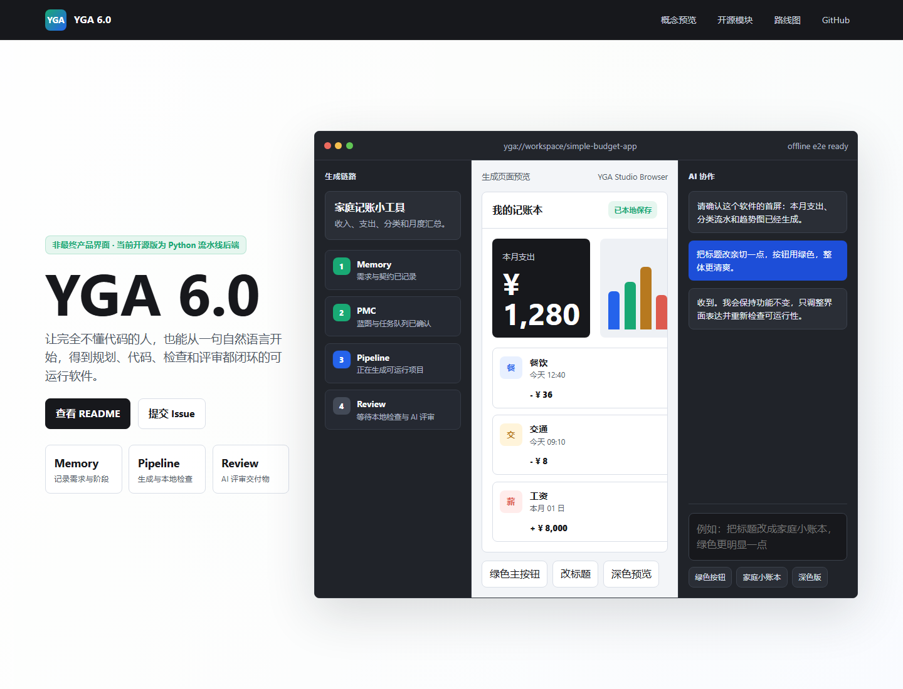
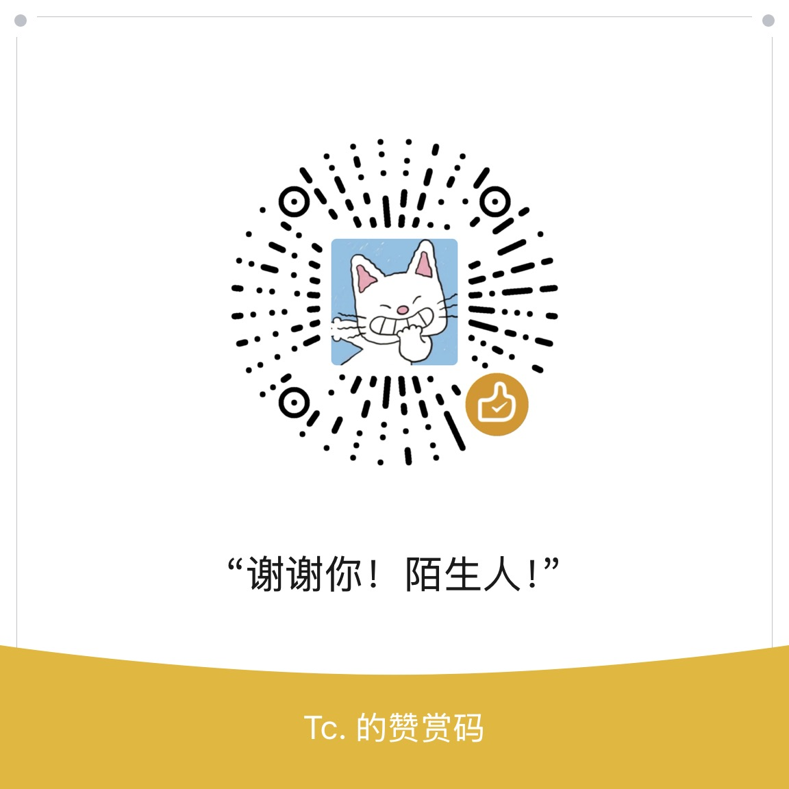

# YGA 6.0

**让完全不懂代码的人，也能做出自己满意的软件。**

YGA（Your Generated App）是一个面向 **普通人** 的 AI 软件生成系统。你只需用自然语言确认「要做什么功能」，系统会在内部完成规划、契约、代码生成、质量检查与评审，最终交付可运行的 Python 项目。

> 未来 AI 开发的方向，不是让程序员写得更快，而是让 **普通人也能开发出自己的软件**。

<p align="center">
  <a href="docs/showcase/index.html">
    
  </a>
</p>

> 上图为 **未来 Web 工作台概念预览**，当前开源快照重点是 Python 后端流水线。可直接打开 [`docs/showcase/index.html`](docs/showcase/index.html) 查看交互演示。

---

## 愿景

项目发起人从 GPT-3 时代起就用 AI 尝试做软件，踩过很多坑：需求说不清、生成不稳定、改一处坏一片、不知道何时算完成……

YGA 要补的，是一条 **普通人走得通、可重复交付** 的完整路径：

```
你确认功能 → 记忆区记录 → 规划 → 生成代码 → 本地检查 → AI 评审 → 交付
```

你 **不需要** 懂 HTTP、模块拆分、接口设计——这些由 YGA 内部处理。

---

## 目前已实现

### Simple 流水线（核心）

| 模块 | 说明 |
|------|------|
| **Memory** | Session 记忆区：需求、契约、阶段门禁、快照、变更 pending |
| **PMC** | 规划与蓝图验收：决定链路与任务队列 |
| **Pipeline** | L2 接口契约 → L3 代码生成 → LocalGate 确定性检查 |
| **Review** | AI 产物审核 + 交付评审 |
| **SimpleOrchestrator** | 普通项目主链编排（P0 产品路径） |

### 验收与测试

- **离线 E2E**（mock AI，无需 API Key）：`python test_simple_e2e_offline.py` ✅
- **Live 冒烟**（需配置 AI）：`python test_simple_live_smoke.py --minimal`（持续优化中）
- 模块测试：`test_memory.py` · `test_pipeline.py` · `test_pmc.py`

### 内置工具（可选）

- `terminal/` — 本地 AI 友好终端模块（Node.js + node-pty）

---

## 路线图

### 近期

- [ ] Simple 主链 **Live 冒烟** 稳定通过
- [ ] 完善文档与示例项目

### 前端线（独立产品方向）

后续更新将开启 **前端线**，包含：

1. **Web 工作台** — 面向非程序员的对话式界面：确认需求、查看进度、一键交付
2. **YGA Studio 浏览器** — 生成页面后，用户可在浏览器里 **手动改界面**，并与 AI **自然交互**：
   - 点选元素说「把这个按钮改成蓝色」
   - 改完即预览，无需懂 HTML/CSS
   - AI 理解你的视觉意图，而不是让你改代码

> 概念预览：在浏览器打开 [`docs/showcase/index.html`](docs/showcase/index.html)

### 更远期

- Medium / Complex 多级项目链路
- 批次开发与组装器
- 路由 AI（按项目复杂度自动选链路）

---

## 快速开始

### 环境

- Windows（主要开发环境）
- Python 3.10+
- 可选：Node.js 18+（仅 `terminal/` 模块）

### 安装

```powershell
chcp 65001
cd YGA6.0
python -m venv .venv
.venv\Scripts\activate
pip install -r requirements.txt
```

### 配置 AI（Live 测试时需要）

```powershell
copy config\ai_config.example.json config\ai_config.json
# 编辑 config\ai_config.json，填入你的 API Key（此文件已在 .gitignore，不会提交）
```

### 运行离线验收（推荐先试这个）

```powershell
python test_simple_e2e_offline.py
```

---

## 项目结构

```
YGA6.0/
├── memory/          # 记忆区：Session、门禁、快照
├── pmc/             # 规划与蓝图
├── pipeline/        # 生成流水线 + SimpleOrchestrator
├── review/          # AI 评审
├── prompts/         # L1/L2/L3 提示词
├── config/          # AI 配置示例
├── docs/showcase/   # 未来 UI 概念预览（HTML）
├── terminal/        # 可选：本地终端工具
└── test_*.py        # 测试与验收脚本
```

---

## 开源说明

- 许可证：[MIT](LICENSE)
- 第三方依赖：[THIRD_PARTY_NOTICES.md](THIRD_PARTY_NOTICES.md)
- **请勿** 将 `config/ai_config.json`（含 API Key）提交到 Git

本仓库为 **开源发布分支**（`release/github-open-source`）。日常开发在 `main` 分支进行。

### 为何开源

个人难以独自承担持续的 API、测试与时间成本，但相信「**让普通人也能做出自己满意的软件**」是大趋势。开源出来，**希望大家一起把这个项目开发好**。

公开快照已脱敏：无 API 密钥、无 Session 运行时数据；本地 Key 请用 `config/ai_config.example.json` 复制，勿提交 Git。

### AI 生成说明

本项目的产品方向、核心思路和使用场景由项目发起人构思；代码、文档初稿与部分实现细节主要由 AI 辅助生成。项目发起人不是专业程序员，也不声称全部代码为人工手写。

如果你发现本仓库存在潜在侵权、许可证不兼容、引用不当或其它合规问题，请通过 Issue 或下方联系方式提醒我。我会尽快核查，并按需要修改、替换或删除相关内容。

### 联系与支持

| 方式 | 信息 |
|------|------|
| QQ / 微信 | `695321101` |
| GitHub | [Issues](https://github.com/695321101/YGA6.0/issues) / Pull Request |

欢迎 Star、Issue、PR。自愿支持可用微信赞赏：

<p align="center">
  
</p>

---

## 贡献

欢迎 Issue 与 Pull Request。请面向 **非程序员用户** 思考：如果某功能只有开发者能懂，它可能不属于 YGA 的核心体验。

---

<p align="center"><sub>Built for everyone who wants software, not syntax.</sub></p>
